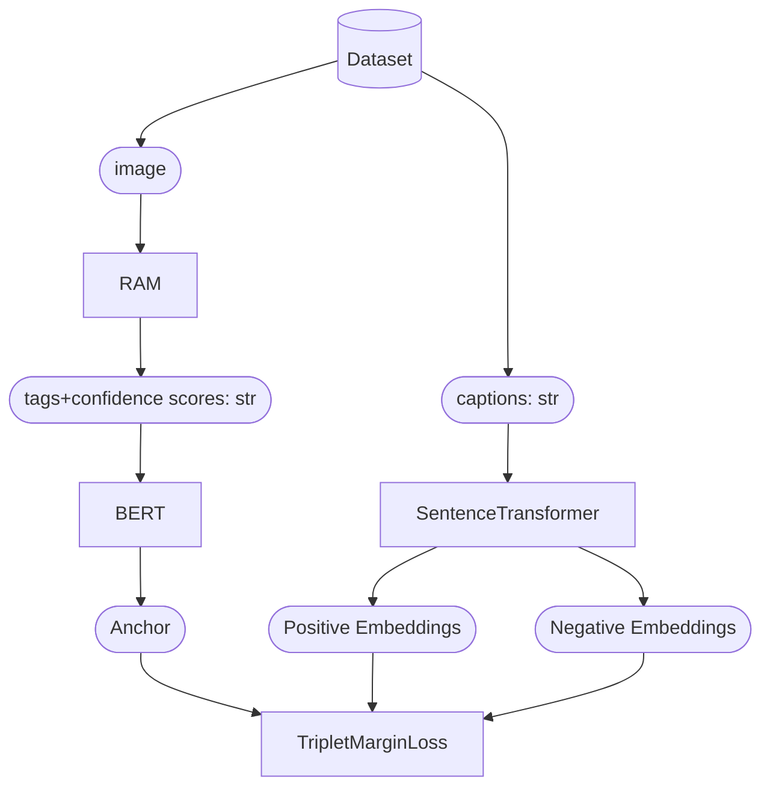

```mermaid
flowchart TD
    dset[(Dataset)] --> img([image])
    dset --> captions

    img --> RAM
    RAM --> tag([tags+confidence scores: str])

    st[SentenceTransformer]
    captions([captions: str]) --> st
    st --> pos([Positive Embeddings])
    st --> neg([Negative Embeddings])

    tag --> bert[BERT]
    bert --> anchor([Anchor])
    anchor --> triplet[TripletMarginLoss]
    pos --> triplet
    neg --> triplet
```
